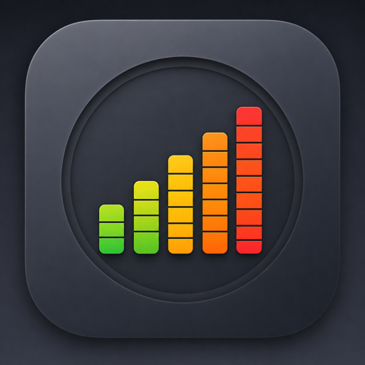

<a id="top"></a>

<p align="center">
  
</p>

<h1 align="center">UsageBar</h1>

<p align="center">
  <strong>Codex &amp; Claude Code usage, at a glance.</strong>
</p>

<p align="center">
  A native, local menu bar and system tray app for macOS and Windows.<br>
  See remaining percentages, reset times, and every usage window in one click.
</p>

<p align="center">
  
  
  
</p>

<p align="center">
  <a href="#turkce">Türkçe</a> · <a href="#english">English</a>
</p>

<p align="center">
  <a href="https://github.com/akwnnwastaken/UsageBar/releases/download/v2.0.0/UsageBar-2.0.0-macOS-arm64.zip"><strong>Download for macOS</strong></a>
  &nbsp;·&nbsp;
  <a href="https://github.com/akwnnwastaken/UsageBar/releases/download/windows-v2.0.0/UsageBar-Setup-x64.exe"><strong>Download for Windows</strong></a>
</p>

---

## Features

- **Codex + Claude Code** — Track both providers from one app and switch manually or automatically.
- **Remaining usage** — See the selected provider's percentage in the menu bar or system tray.
- **Reset countdowns** — Know when each available limit refreshes.
- **Every usage window** — Inspect five-hour, weekly, and any additional windows returned for your account.
- **Local history** — Keep up to 24 hours of percentage-only history for each provider and window.
- **macOS + Windows** — Use a native menu bar app on macOS or system tray app on Windows.
- **Local-first** — Reuse existing provider sessions and keep raw provider output out of history.

## Downloads

Version **2.0.0** is current for both platforms. macOS and Windows use separate release tags.

| Platform | Package | Download | Release notes |
| --- | --- | --- | --- |
| macOS 13+ · Apple Silicon | `UsageBar-2.0.0-macOS-arm64.zip` | [Download ZIP](https://github.com/akwnnwastaken/UsageBar/releases/download/v2.0.0/UsageBar-2.0.0-macOS-arm64.zip) | [`v2.0.0`](https://github.com/akwnnwastaken/UsageBar/releases/tag/v2.0.0) |
| Windows 10 1809+ · x64 | `UsageBar-Setup-x64.exe` | [Download installer](https://github.com/akwnnwastaken/UsageBar/releases/download/windows-v2.0.0/UsageBar-Setup-x64.exe) | [`windows-v2.0.0`](https://github.com/akwnnwastaken/UsageBar/releases/tag/windows-v2.0.0) |
| Windows 10 1809+ · x64 | `UsageBar-Windows-x64.zip` | [Download portable ZIP](https://github.com/akwnnwastaken/UsageBar/releases/download/windows-v2.0.0/UsageBar-Windows-x64.zip) | [`windows-v2.0.0`](https://github.com/akwnnwastaken/UsageBar/releases/tag/windows-v2.0.0) |

> [!NOTE]
> The `main` branch contains the source for both platforms. Release packages, signing status, and first-launch guidance differ by platform; read the matching installation section below.

---

<a id="turkce"></a>

## Türkçe

UsageBar, seçtiğiniz sağlayıcının kalan kullanım oranını macOS menü çubuğunda veya Windows sistem tepsisinde gösterir. Ayrıntı paneli kullanım pencerelerini, sıfırlanma sürelerini ve yerel geçmiş grafiklerini tek yerde toplar.

### Özellikler

- **Codex + Claude Code:** İki sağlayıcıyı tek uygulamada izler.
- **Kalan kullanım:** Simgede kullanılan değil, kalan yüzdeyi gösterir.
- **Birden çok pencere:** 5 saatlik, haftalık ve sağlayıcının döndürdüğü diğer süreli pencereleri ayrı ayrı listeler.
- **Sıfırlama süreleri:** Her pencere için sıfırlanmaya kalan süreyi gösterir.
- **Yerel geçmiş:** Her sağlayıcı/pencere çifti için 24 saate kadar kalan yüzde grafiği tutar.
- **Güvenilir durum:** Geçici hatalarda son başarılı değeri zamanı ve hata nedeni ile eski veri olarak göstermeye devam eder.
- **Sağlayıcı seçimi:** `Otomatik | Codex | Claude` ile sabit seçim veya 30 saniyelik otomatik geçiş sunar.
- **Esnek görünüm:** Renkler kapatılabilir; üç uyarı eşiği profili ve 1, 2 veya 5 dakikalık yenileme aralığı seçilebilir.
- **Otomatik başlatma:** İsteğe bağlı olarak kullanıcı oturum açtığında başlar.
- **İki dil, iki platform:** Türkçe ve İngilizce arayüz; macOS ve Windows desteği.

### Yüzde nasıl hesaplanıyor?

Simgedeki değer **kullanılan değil, kalan yüzdedir**.

- **Claude Code:** 5 saatlik pencere varsa onu gösterir; bu pencere yoksa haftalık değere döner.
- **Codex:** Hesabın sunduğu pencereler arasından en düşük kalan oranı gösterir. Hesap yalnızca haftalık pencere sunuyorsa haftalık değeri kullanır.

Simgeye tıkladığınızda seçili sağlayıcının döndürdüğü tüm pencereleri ayrı ayrı görebilirsiniz. UsageBar yalnızca hesapta gerçekten bulunan pencereleri gösterir.

### Veri kaynakları ve yenileme

- **Codex:** Kurulu Codex aracının yerel `account/rateLimits/read` arayüzünü kullanır.
- **Claude Code:** Claude Code'un yerel kullanım komutunun çıktısını okur. Bu komut oturum kaydı bırakmaz ve model kotası tüketmez.

UsageBar sağlayıcıların web sitelerine kendi hesabıyla giriş yapmaz; bilgisayarınızdaki mevcut Codex ve Claude Code oturumlarını kullanır.

Kullanım verisi 1, 2 veya 5 dakikada bir yenilenebilir; varsayılan aralık 5 dakikadır.

Panel açıldığında ekrandaki veri 30 saniyeden eskiyse ayrıca yenileme başlatılır. İki sağlayıcı bağlı ve `Otomatik` seçiliyse gösterilen sağlayıcı 30 saniyede bir değişir; bu geçiş tek başına yeni bir sağlayıcı sorgusu başlatmaz.

### Kullanım geçmişi ve veri kararlılığı

Mini grafik açıkken UsageBar her sağlayıcı/pencere çifti için yalnızca ölçüm zamanı ile kalan yüzdeyi yerel olarak saklar.

Kayıtlar açılışta ve her yeni ölçümde 24 saat, seri sayısı, örnek sayısı ve veri boyutu sınırlarına göre budanır. Sağlayıcı yanıtları, ham komut çıktıları ve kimlik bilgileri geçmişe yazılmaz.

Grafik, mevcut kullanım dönemini net göstermek için son sıfırlamadan itibaren çizilir. Kalan oran yaklaşık %100'e büyük bir sıçramayla döndüğünde yeni dönem başlar. Küçük hareketleri görünür kılmak için uyarlanabilir ölçek kullanılır.

Sağlayıcılar yüzdeyi tam sayıya yuvarladığından değer 41 ↔ 42 gibi oynayabilir. Yeni açılan bir okuma oturumu bazen canlı değerin gerisindeki önbellekli bir anlık değeri de döndürebilir.

Gerçek bir sıfırlama eşiğinin altındaki yükselişler üç ardışık aynı okumayla doğrulanana kadar arayüzde bekletilir; büyük sıfırlamalar hemen görünür. Kaydedilen geçmiş her zaman ham ölçümü korur.

Grafiğin üzerinde imleç gezdirildiğinde yatay konuma zaman olarak en yakın gerçek kayıt seçilir.

Dikey kılavuz, vurgulanan nokta, yerel saat ve kalan yüzde gösterilir; ara değer üretilmez. Her grafiğin imleç durumu bağımsızdır.

Bir sağlayıcı geçici olarak yanıt vermezse son başarılı değer zaman damgası ve güvenli hata nedeni ile eski veri olarak kalır. Eski değer yeni bir geçmiş örneği olarak yeniden kaydedilmez.

### Platform notları

#### macOS

- Dock simgesi veya ana pencere açmadan yalnızca menü çubuğunda çalışır.
- Codex için ChatGPT uygulamasını veya kurulu Codex CLI'ı; Claude için kurulu Claude Code CLI'ı okur.
- Otomatik başlatma macOS **Giriş Öğeleri** sistemini kullanır.
- Sağlayıcı komutlarını ayrı bir süreç grubunda çalıştırır.
- Apple Silicon (`arm64`) için dağıtılır.

#### Windows

- Yerel **C# / .NET 8 / WPF** sistem tepsisi uygulamasıdır; görev çubuğu düğmesi veya ana pencere açmaz.
- Codex'in resmî Windows kurulumunu ve Claude Code'un yerel Windows kurulumunu destekler.
- Claude Code'u **WSL** üzerinden okuyabilir; bu yol 2.0.0 sürümünde fiziksel olarak doğrulanmamıştır.
- Taşınabilir ZIP ve kullanıcıya özel kurulum paketi olarak dağıtılır.
- Kurulum paketi yönetici izni istemez ve UsageBar'ı kurulum sonunda otomatik başlatmaz.
- Sağlayıcı süreçlerini `CreateProcessW` ile, kabuk kullanmadan başlatır ve bir **Job Object** içinde sınırlandırır.
- Servis, sürücü, zamanlanmış görev veya `PATH` değişikliği yapmaz.

### Gereksinimler

Yalnızca izlemek istediğiniz sağlayıcının kurulu ve oturumunun açık olması yeterlidir.

| Platform | Sistem | Sağlayıcı | Kaynak koddan derleme |
| --- | --- | --- | --- |
| macOS | macOS 13+, Apple Silicon (`arm64`) | ChatGPT uygulaması veya giriş yapılmış Codex CLI; giriş yapılmış Claude Code CLI | Xcode Command Line Tools |
| Windows | Windows 10 sürüm 1809+ (Windows 11 dahil), x64 | Giriş yapılmış resmî Windows Codex kurulumu; yerel Claude Code veya desteklenen WSL yolu | .NET 8 SDK |

Windows son kullanıcı paketleri self-contained'dır; ayrıca .NET Runtime kurulması gerekmez.

### Kurulum

#### macOS

1. [`v2.0.0` sürümünden](https://github.com/akwnnwastaken/UsageBar/releases/tag/v2.0.0) `UsageBar-2.0.0-macOS-arm64.zip` dosyasını indirin.
2. ZIP'i açın ve `UsageBar.app` uygulamasını **Applications** klasörüne taşıyın.
3. UsageBar'ı açın; menü çubuğundaki `%—` simgesinden sağlayıcınızı bağlayın.

> [!WARNING]
> Bu paket yalnızca Apple Silicon (`arm64`) içindir. Ad hoc imzalıdır ancak henüz Apple tarafından notarize edilmemiştir; bu nedenle ilk açılışta doğrulama uyarısı görebilirsiniz. Aşağıdaki adımları yalnızca bu deponun resmî Release dosyası için uygulayın.

**İlk açılış uyarısını güvenli biçimde onaylama**

1. UsageBar'ı bir kez açmayı deneyin.
2. Doğrulama uyarısında **Çöp Sepeti'ne Taşı** yerine **Bitti** düğmesine basın.
3. Apple menüsü → **Sistem Ayarları** → **Gizlilik ve Güvenlik** bölümünü açın.
4. **Güvenlik** bölümünde UsageBar için **Yine de Aç** düğmesine basın.
5. Touch ID veya Mac oturum parolanızla onaylayın, ardından **Aç** düğmesine basın.

Bu onay aynı uygulama için yalnızca ilk açılışta gerekir. **Yine de Aç** görünmüyorsa UsageBar'ı tekrar açmayı deneyip aynı bölüme dönün; macOS bu seçeneği açma denemesinden sonra yaklaşık bir saat gösterir.

> [!CAUTION]
> Gatekeeper'ı tamamen kapatmayın ve internetteki rastgele `sudo`, `spctl` veya `xattr` komutlarını çalıştırmayın. macOS uygulamanın bilinen kötü amaçlı yazılım içerdiğini bildirirse devam etmeyin; dosyayı silip resmî Release'den yeniden indirin.

Apple'ın resmî açıklaması: [Apple'ın kötü amaçlı yazılım denetimi yapamadığı bir uygulamayı açma](https://support.apple.com/guide/mac-help/mchleab3a043/mac)

#### Windows kurulum paketi — önerilen

1. [`windows-v2.0.0` sürümünü](https://github.com/akwnnwastaken/UsageBar/releases/tag/windows-v2.0.0) açın.
2. `UsageBar-Setup-x64.exe` dosyasını indirin.
3. İsterseniz aşağıdaki doğrulama adımlarını uygulayın.
4. Kurulum paketini çalıştırın. Yalnızca geçerli kullanıcı için kurulur ve yönetici izni istemez.
5. Kurulum tamamlandığında Başlat menüsünde `UsageBar` arayın ve uygulamayı açın.
6. Simge görünmüyorsa görev çubuğundaki `^` taşma alanını kontrol edin.

Kurulum paketi UsageBar'ı bilerek otomatik başlatmaz. Otomatik başlatma tercihi uygulamaya aittir ve yalnızca geçerli kullanıcının ayarlarında tutulur.

> [!WARNING]
> Windows paketleri henüz imzalanmamıştır. SmartScreen ilk çalıştırmada uyarı gösterebilir. Devam etmeden önce SHA-256 değerini doğrulayın; SmartScreen'i sistem genelinde kapatmayın.

#### Windows taşınabilir sürüm

1. [`UsageBar-Windows-x64.zip`](https://github.com/akwnnwastaken/UsageBar/releases/download/windows-v2.0.0/UsageBar-Windows-x64.zip) dosyasını indirin.
2. Kalıcı ve yazılabilir bir klasöre çıkarın.
3. Uygulamayı doğrudan ZIP'in içinden çalıştırmayın.
4. `UsageBar.exe` dosyasını çalıştırın.

### Paket doğrulama

#### macOS

Release sayfasındaki `.sha256` dosyasıyla karşılaştırmak için:

```sh
shasum -a 256 ~/Downloads/UsageBar-2.0.0-macOS-arm64.zip
```

CI tarafından üretilen paketin GitHub build provenance kaydını doğrulamak için:

```sh
gh attestation verify ~/Downloads/UsageBar-2.0.0-macOS-arm64.zip \
  --repo akwnnwastaken/UsageBar \
  --signer-workflow akwnnwastaken/UsageBar/.github/workflows/release-candidate.yml
```

SHA-256 dosyanın değişmediğini, attestation ise paketin bu deponun GitHub Actions akışı tarafından üretildiğini doğrular.

#### Windows

PowerShell'de, indirdiğiniz dosyanın bulunduğu klasörde:

```powershell
Get-FileHash .\UsageBar-Setup-x64.exe -Algorithm SHA256
Get-FileHash .\UsageBar-Windows-x64.zip -Algorithm SHA256
```

Sonucu aynı Release sayfasındaki eşleşen `.sha256` dosyası ve Release notlarındaki değerle karşılaştırın. Üç değer aynı olmalıdır.

### Kullanım ve gizlilik

1. UsageBar'ı açın ve `%—` simgesine tıklayın.
2. **Codex'e bağlan** veya **Claude Code'a bağlan** seçeneğini kullanın.
3. İki sağlayıcı bağlıysa `Otomatik | Codex | Claude` seçicisiyle görünümü belirleyin.
4. Görünüm, renkler, geçmiş ve yenileme aralığını ayarlardan özelleştirin.
5. Sorun bildirirken **Tanılama özetini kopyala** seçeneğini kullanın.

UsageBar ilk açılışta hiçbir sağlayıcıyı sorgulamaz; erişim ancak bağlantı düğmesine bastığınızda başlar. Bağlantı seçimi yalnızca yerel bir tercihtir. UsageBar parola, API anahtarı, erişim anahtarı veya oturum belirteci saklamaz.

Sağlayıcı komutları uygulamaya özel geçici bir klasörde, sınırlı bir ortam değişkeni listesiyle çalıştırılır. Proje ayarları, eklentiler, MCP sunucuları, Chrome entegrasyonu ve kabuk başlangıç ayarları yüklenmez.

Zaman aşımında çocuk süreçler kapatılır, çıktı 2 MiB ile sınırlandırılır ve çalıştırılabilir dosyalar kullanılmadan önce doğrulanır.

**macOS izinleri**

UsageBar Tam Disk Erişimi, Belgeler/Masaüstü erişimi, ağ diski erişimi, Ekran Kaydı, Erişilebilirlik veya Otomasyon izni istemez.

Claude Code bağlanırken macOS mevcut `Claude Code-credentials` Anahtar Zinciri kaydı için izin isteyebilir; tekrar sorulmaması için bir kez **Her Zaman İzin Ver** seçilebilir.

**Windows davranışı**

Kurulum paketi yönetici izni istemez; servis, sürücü veya zamanlanmış görev kurmaz ve `PATH` değerini değiştirmez. Telemetri veya çökme raporlama bağımlılığı yoktur.

Otomatik başlatma yalnızca UsageBar'ın geçerli kullanıcıya ait `HKCU\Software\Microsoft\Windows\CurrentVersion\Run` girdisini yönetir.

Tanılama özeti sürüm, işletim sistemi sürümü, bağlantı durumu, pencere türleri ve sabit güvenli hata kodlarıyla sınırlıdır. Ham CLI çıktısı, dosya yolu, kullanıcı adı veya kimlik bilgisi eklemez.

### Sorun giderme

- **Windows simgesi görünmüyor:** Görev çubuğundaki `^` taşma alanını kontrol edin.
- **macOS uygulamayı engelliyor:** Yalnızca yukarıdaki **Gizlilik ve Güvenlik → Yine de Aç** akışını kullanın; Gatekeeper'ı kapatmayın.
- **SmartScreen uyarıyor:** İndirmeyi SHA-256 ile doğrulayın. SmartScreen'i sistem genelinde kapatmayın.
- **Sağlayıcı bağlanmıyor:** İlgili Codex veya Claude Code kurulumunda oturumun açık olduğunu doğrulayın, ardından UsageBar'da yeniden deneyin.
- **Eski veri gösteriliyor:** Paneldeki zaman ve güvenli hata nedeni son başarılı ölçümün neden korunmuş olduğunu açıklar. Sağlayıcı kurulumunu kontrol edip elle yenileyin.
- **Taşınabilir Windows sürümünü taşıdınız:** Otomatik başlatma eski konumu gösteriyorsa tercihi kapatıp yeni konumdan yeniden açın.
- **Yardım isterken:** **Tanılama özetini kopyala** çıktısını paylaşın; token, kimlik bilgisi, ham sağlayıcı çıktısı veya özel dosya yolu göndermeyin.

Windows keşif ve fiziksel doğrulama ayrıntıları için [Windows port notlarına](docs/windows-port.md) bakın. Hassas bir güvenlik açığını herkese açık Issue yerine [güvenlik politikasındaki](SECURITY.md) özel bildirim adımlarıyla paylaşın.

### Kaynak koddan derleme

#### macOS

```sh
git clone https://github.com/akwnnwastaken/UsageBar.git
cd UsageBar
chmod +x build.sh
./build.sh
open build/UsageBar.app
```

`build.sh` kanonik SwiftPM grafiğiyle XCTest testlerini ve paket içi öz testleri çalıştırır, ardından temiz paketi yerel kullanım için ad hoc imzalar.

Ek doğrulamalar:

```sh
./tests/build_regression.sh
./tests/security_acceptance.sh
```

#### Windows

Komutları `windows/` klasöründen çalıştırın; `windows/global.json` SDK'yı .NET 8'e sabitler.

```powershell
git clone https://github.com/akwnnwastaken/UsageBar.git
cd UsageBar/windows
dotnet restore UsageBar.Windows.sln
dotnet build UsageBar.Windows.sln --configuration Release --no-restore
dotnet test UsageBar.Windows.sln --configuration Release
```

Uygulamayı çalıştırmak için:

```powershell
dotnet run --project src/UsageBar.Windows.App/UsageBar.Windows.App.csproj -c Release
```

Paketlemek ve doğrulamak için:

```powershell
./scripts/package.ps1
./scripts/package-installer.ps1
./scripts/verify-package.ps1
./scripts/verify-installer.ps1
```

`package.ps1` self-contained taşınabilir ZIP'i; `package-installer.ps1` ise Inno Setup kurulum paketini üretir. `Core` ve `Core.Tests` projeleri `net8.0` hedefler; Windows'a özel testler diğer platformlarda atlanır.

### Proje yapısı

```text
UsageBar/
├── Sources/UsageBar/                       # macOS uygulaması ve sağlayıcı okuyucuları
├── Sources/UsageBarCore/                   # Paylaşılan saf kurallar ve modeller
├── Sources/UsageBarProcessLauncher/        # Shell kullanmayan süreç grubu başlatıcısı
├── Package.swift                           # Kanonik SwiftPM derleme tanımı
├── Info.plist                              # macOS sürüm ve uygulama metadata'sı
├── build.sh                                # macOS derleme, test ve yerel imzalama
├── tests/                                  # XCTest ve macOS kabul betikleri
├── windows/
│   ├── UsageBar.Windows.sln                # Windows çözümü
│   ├── src/                                # Core, Infrastructure ve WPF tepsi uygulaması
│   ├── tests/                              # xUnit testleri
│   ├── scripts/                            # Paketleme ve doğrulama betikleri
│   └── installer/                          # Inno Setup tanımı ve Windows simgesi
├── shared/fixtures/                        # İki platformun paylaştığı sağlayıcı örnekleri
├── docs/windows-port.md                    # Windows tasarım ve doğrulama notları
├── .github/workflows/                      # macOS, Windows ve release iş akışları
├── SECURITY.md                             # İki dilli güvenlik politikası
└── LICENSE                                 # MIT Lisansı
```

### Geliştirme ve lisans

Değişiklikler ayrı commitler ve pull requestler üzerinden ilerletilir. UsageBar [MIT Lisansı](LICENSE) ile sunulur.

<p align="right"><a href="#top">Başa dön ↑</a></p>

---

<a id="english"></a>

## English

UsageBar shows the selected provider's remaining usage in the macOS menu bar or Windows system tray. Its detail panel brings usage windows, reset times, and local history charts together in one place.

### Features

- **Codex + Claude Code:** Track both providers from one app.
- **Remaining usage:** See the percentage left, not the percentage used.
- **Multiple windows:** List five-hour, weekly, and any other duration returned by the provider.
- **Reset times:** See a countdown for every available window.
- **Local history:** Keep up to 24 hours of remaining-percentage history for each provider/window pair.
- **Resilient status:** Keep the last successful value visible with its timestamp and failure reason during temporary errors.
- **Provider selection:** Pin a provider or rotate every 30 seconds with `Auto | Codex | Claude`.
- **Flexible display:** Disable colors, choose from three alert-threshold profiles, and refresh every 1, 2, or 5 minutes.
- **Launch at login:** Start automatically with the signed-in user when enabled.
- **Two languages, two platforms:** Turkish and English UI on macOS and Windows.

### How is the percentage calculated?

The displayed value is the **remaining percentage, not the used percentage**.

- **Claude Code:** Uses the five-hour window when available and falls back to weekly only when five-hour data is missing.
- **Codex:** Uses the lowest remaining percentage among the windows available on the account. If the account exposes only a weekly window, UsageBar uses that window.

Click the icon to inspect every window returned for the selected provider. UsageBar only shows windows actually available on the account.

### Data sources and refresh behavior

- **Codex:** Uses the installed Codex tool's local `account/rateLimits/read` interface.
- **Claude Code:** Reads the output of Claude Code's local usage command. The command leaves no session record and consumes no model quota.

UsageBar does not sign in to provider websites itself. It uses the existing Codex and Claude Code sessions on your computer.

Usage can refresh every 1, 2, or 5 minutes; the default is 5 minutes.

Opening the panel also starts a refresh when the displayed data is more than 30 seconds old. When both providers are connected and `Auto` is selected, the displayed provider changes every 30 seconds; rotation itself does not run a new provider query.

### Usage history and data stability

When mini charts are enabled, UsageBar stores only the measurement time and remaining percentage for each provider/window pair, locally.

Data is pruned on launch and after each measurement using 24-hour, series-count, sample-count, and encoded-size limits. Provider responses, raw command output, and credentials are never written to history.

The chart starts at the most recent reset to keep the current usage period readable. A large jump back toward 100% starts a new period. Adaptive scaling makes small changes visible.

Providers round percentages to whole numbers, so a value can flicker between 41 and 42. A newly started reader can also receive a cached snapshot behind the live value.

Rises below the reset threshold are held until the same value persists across three consecutive readings; large resets appear immediately. Recorded history always keeps the raw measurement.

Hovering a chart selects the real recorded sample nearest in time to that horizontal position.

UsageBar shows a vertical guide, highlighted point, local time, and remaining percentage; it never invents an interpolated value. Each chart owns independent hover state.

If a provider temporarily fails, the last successful value remains visible with its timestamp and safe failure reason. A stale value is never recorded again as a new history sample.

### Platform notes

#### macOS

- Runs only in the menu bar, without a Dock icon or main window.
- Reads the ChatGPT app or an installed Codex CLI for Codex, and an installed Claude Code CLI for Claude.
- Launch at login uses the macOS **Login Items** system.
- Provider commands run in a separate process group.
- Distributed for Apple Silicon (`arm64`).

#### Windows

- A native **C# / .NET 8 / WPF** system tray application with no taskbar button or main window.
- Supports Codex's official Windows installation and Claude Code's native Windows installation.
- Can read Claude Code through **WSL**; that path was not physically validated for the 2.0.0 release.
- Distributed as a portable ZIP and a per-user installer.
- The installer does not require administrator permission and does not launch UsageBar automatically when setup finishes.
- Provider processes start through `CreateProcessW` without a shell and are contained in a **Job Object**.
- No service, driver, scheduled task, or `PATH` modification is used.

### Requirements

Only the provider you want to track needs to be installed and signed in.

| Platform | System | Provider | Build from source |
| --- | --- | --- | --- |
| macOS | macOS 13+, Apple Silicon (`arm64`) | ChatGPT app or signed-in Codex CLI; signed-in Claude Code CLI | Xcode Command Line Tools |
| Windows | Windows 10 version 1809+ (including Windows 11), x64 | Signed-in official Windows Codex installation; native Claude Code or supported WSL path | .NET 8 SDK |

Windows end-user packages are self-contained; no separate .NET Runtime installation is required.

### Installation

#### macOS

1. Download `UsageBar-2.0.0-macOS-arm64.zip` from the [`v2.0.0` release](https://github.com/akwnnwastaken/UsageBar/releases/tag/v2.0.0).
2. Extract the ZIP and move `UsageBar.app` to the **Applications** folder.
3. Open UsageBar and connect a provider from the `%—` icon in the menu bar.

> [!WARNING]
> This package is for Apple Silicon (`arm64`) only. It is ad hoc signed but not yet notarized by Apple, so macOS may show a verification warning on first launch. Follow the steps below only for the official Release file from this repository.

**Approve the first-launch warning safely**

1. Try to open UsageBar once.
2. In the verification warning, click **Done** instead of **Move to Bin**.
3. Open Apple menu → **System Settings** → **Privacy & Security**.
4. In the **Security** section, click **Open Anyway** for UsageBar.
5. Authenticate with Touch ID or your Mac login password, then click **Open**.

Approval is required only on the first launch of the same app. If **Open Anyway** is missing, try opening UsageBar again and return to the same section; macOS exposes the option for about one hour after the launch attempt.

> [!CAUTION]
> Do not disable Gatekeeper globally or run arbitrary `sudo`, `spctl`, or `xattr` commands from the internet. If macOS reports known malware, do not continue; delete the file and download it again from the official Release.

Apple's official guidance: [Open an app Apple cannot check for malicious software](https://support.apple.com/guide/mac-help/mchleab3a043/mac)

#### Windows installer — recommended

1. Open the [`windows-v2.0.0` release](https://github.com/akwnnwastaken/UsageBar/releases/tag/windows-v2.0.0).
2. Download `UsageBar-Setup-x64.exe`.
3. Optionally complete the verification steps below.
4. Run the installer. It installs for the current user only and does not request administrator permission.
5. When setup finishes, search for `UsageBar` in the Start menu and open it.
6. If the icon is hidden, check the `^` overflow area on the taskbar.

The installer deliberately does not launch UsageBar automatically. The autostart preference belongs to the app and is stored only in the current user's settings.

> [!WARNING]
> Windows packages are currently unsigned. SmartScreen may warn on first run. Verify the SHA-256 before continuing; do not disable SmartScreen globally.

#### Windows portable

1. Download [`UsageBar-Windows-x64.zip`](https://github.com/akwnnwastaken/UsageBar/releases/download/windows-v2.0.0/UsageBar-Windows-x64.zip).
2. Extract it to a permanent, writable folder.
3. Do not run the app directly from inside the ZIP.
4. Run `UsageBar.exe`.

### Package verification

#### macOS

Compare the download with the `.sha256` file on the Release page:

```sh
shasum -a 256 ~/Downloads/UsageBar-2.0.0-macOS-arm64.zip
```

Verify GitHub build provenance for the CI-produced package:

```sh
gh attestation verify ~/Downloads/UsageBar-2.0.0-macOS-arm64.zip \
  --repo akwnnwastaken/UsageBar \
  --signer-workflow akwnnwastaken/UsageBar/.github/workflows/release-candidate.yml
```

SHA-256 checks that the file did not change; attestation checks that the package was produced by this repository's GitHub Actions workflow.

#### Windows

In PowerShell, from the folder containing the downloads:

```powershell
Get-FileHash .\UsageBar-Setup-x64.exe -Algorithm SHA256
Get-FileHash .\UsageBar-Windows-x64.zip -Algorithm SHA256
```

Compare each result with the matching `.sha256` file on the same Release page and the value in the release notes. All three values should match.

### Usage and privacy

1. Open UsageBar and click the `%—` icon.
2. Choose **Connect Codex** or **Connect Claude Code**.
3. If both are connected, choose a view with `Auto | Codex | Claude`.
4. Customize appearance, colors, history, and refresh interval in settings.
5. When reporting a problem, use **Copy diagnostics**.

UsageBar does not query either provider on first launch; access begins only after you click a connection button. Connecting saves a local preference only. UsageBar does not store passwords, API keys, access tokens, or session tokens.

Provider commands run in an app-specific temporary directory with a restricted environment. Project settings, plugins, MCP servers, Chrome integration, and shell startup files are not loaded.

Timeouts terminate child processes, output is limited to 2 MiB, and provider executables are validated before use.

**macOS permissions**

UsageBar does not require Full Disk Access, Documents/Desktop access, network volume access, Screen Recording, Accessibility, or Automation.

When connecting Claude Code, macOS may ask for access to the existing `Claude Code-credentials` Keychain item; choose **Always Allow** once to prevent repeated prompts.

**Windows behavior**

The installer does not require administrator permission, install a service, driver, or scheduled task, or modify `PATH`. It has no telemetry or crash-reporting dependency.

Autostart only manages UsageBar's current-user `HKCU\Software\Microsoft\Windows\CurrentVersion\Run` entry.

The diagnostic summary is limited to version, operating-system version, connection state, window kinds, and fixed safe error codes. It excludes raw CLI output, file paths, user names, and credentials.

### Troubleshooting

- **Windows icon is missing:** Check the `^` overflow area on the taskbar.
- **macOS blocks the app:** Use only the **Privacy & Security → Open Anyway** flow above; do not disable Gatekeeper.
- **SmartScreen warns:** Verify the download with SHA-256. Do not disable SmartScreen globally.
- **A provider will not connect:** Confirm that the corresponding Codex or Claude Code installation is signed in, then try again in UsageBar.
- **UsageBar shows stale data:** The panel's timestamp and safe failure reason explain why the last successful measurement was preserved. Check the provider installation and refresh manually.
- **You moved the portable Windows build:** If autostart still points to the old location, turn the preference off and enable it again from the new location.
- **When asking for help:** Share **Copy diagnostics** output; do not send tokens, credentials, raw provider output, or private file paths.

See the [Windows port notes](docs/windows-port.md) for discovery and physical-validation detail. Report sensitive vulnerabilities through the private process in the [security policy](SECURITY.md), not a public Issue.

### Build from source

#### macOS

```sh
git clone https://github.com/akwnnwastaken/UsageBar.git
cd UsageBar
chmod +x build.sh
./build.sh
open build/UsageBar.app
```

`build.sh` uses the canonical SwiftPM graph, runs XCTest and packaged-binary self-tests, then applies an ad hoc signature to the clean bundle for local use.

Additional checks:

```sh
./tests/build_regression.sh
./tests/security_acceptance.sh
```

#### Windows

Run commands from `windows/`; `windows/global.json` pins the SDK to .NET 8.

```powershell
git clone https://github.com/akwnnwastaken/UsageBar.git
cd UsageBar/windows
dotnet restore UsageBar.Windows.sln
dotnet build UsageBar.Windows.sln --configuration Release --no-restore
dotnet test UsageBar.Windows.sln --configuration Release
```

Run the app directly:

```powershell
dotnet run --project src/UsageBar.Windows.App/UsageBar.Windows.App.csproj -c Release
```

Package and verify:

```powershell
./scripts/package.ps1
./scripts/package-installer.ps1
./scripts/verify-package.ps1
./scripts/verify-installer.ps1
```

`package.ps1` creates the self-contained portable ZIP; `package-installer.ps1` creates the Inno Setup installer. `Core` and `Core.Tests` target `net8.0`; Windows-specific tests are skipped on other platforms.

### Repository map

```text
UsageBar/
├── Sources/UsageBar/                       # macOS app and provider readers
├── Sources/UsageBarCore/                   # Shared pure policies and models
├── Sources/UsageBarProcessLauncher/        # Shell-free process-group launcher
├── Package.swift                           # Canonical SwiftPM build definition
├── Info.plist                              # macOS app and version metadata
├── build.sh                                # macOS build, tests, and local signing
├── tests/                                  # XCTest and macOS acceptance scripts
├── windows/
│   ├── UsageBar.Windows.sln                # Windows solution
│   ├── src/                                # Core, Infrastructure, and WPF tray app
│   ├── tests/                              # xUnit tests
│   ├── scripts/                            # Packaging and verification scripts
│   └── installer/                          # Inno Setup definition and Windows icon
├── shared/fixtures/                        # Provider samples shared across platforms
├── docs/windows-port.md                    # Windows design and validation notes
├── .github/workflows/                      # macOS, Windows, and release workflows
├── SECURITY.md                             # Bilingual security policy
└── LICENSE                                 # MIT License
```

### Development and license

Changes are developed through separate commits and pull requests. UsageBar is available under the [MIT License](LICENSE).

<p align="right"><a href="#top">Back to top ↑</a></p>
